

Learn how to install blendOS on your computer through this guide!

## What you'll need

* A 64-bit CPU, from no earlier than 2009.
* A minimum of 4 GBs of RAM and 25 GBs of storage.
* A spare USB drive, with a minimum size of 4GBs.

<!--truncate-->

## Installation

You can skip to a particular step from the outline on the right, if you're on a computer.

### Step 1: Download the latest blendOS ISO file

:::tip

If you're coming from Windows or macOS, it's recommended that you download the [**KDE Plasma**](https://kde.org/plasma-desktop/) edition of blendOS. It is extremely intuitive, and has a similar workflow to other operating systems.

However, if you prefer a functional default layout and are open to something new, the [**GNOME**](https://www.gnome.org/) edition may be for you.
:::

1. KDE Plasma Edition:
    * ~~[Download from Google Drive (Broken ISO) (**DO NOT USE**)](https://drive.google.com/file/d/1SOTy4MCB_n_28Vm8-ZNbgxLOR9LV0ZMc/view)~~
    * [Download from SourceForge](https://sourceforge.net/projects/blendos/files/23.04-1/Plasma/blendOS-2023.04.22-x86_64-plasma.iso/download)
    * [Download from MEGA](https://mega.nz/file/2ExDkZQD#BIZ0ANkPdPMytkjqhQNaFLNca9T-BOa0DFbSYv_Y84c)
    * [Download from Asterisk's backup mirror (slow)](https://blend.shinken.studio/blendOS-2023.04.22-x86_64-plasma.iso)
    * [Download from](http://paid-01.pluoxhost.xyz:4006/blendOS-2023.04.22-x86_64-plasma.iso) [**PluoxHost**](https://pluoxhost.xyz) [mirror](http://paid-01.pluoxhost.xyz:4006/blendOS-2023.04.22-x86_64-plasma.iso)
2. GNOME Edition:
    * ~~[Download from Google Drive (Broken ISO) (**DO NOT USE**)](https://drive.google.com/file/d/1nT_lMZlVy2y6VVJUas1qph4I7-gxsMfB/view)~~
    * [Download from SourceForge](https://sourceforge.net/projects/blendos/files/23.04-1/GNOME/blendOS-2023.04.22-x86_64-gnome.iso/download)
    * [Download from MEGA](https://mega.nz/file/eYAkRRwR#ogEFqh7ls08cis7EqjlGFdvqELtPoxUtqG7EN6pIqCc)
    * [Download from Asterisk's backup mirror (slow)](https://blend.shinken.studio/blendOS-2023.04.22-x86_64-gnome.iso)
    * [Download from](http://paid-01.pluoxhost.xyz:4006/blendOS-2023.04.22-x86_64-gnome.iso) [**PluoxHost**](https://pluoxhost.xyz) [mirror](http://paid-01.pluoxhost.xyz:4006/blendOS-2023.04.22-x86_64-gnome.iso)

### Step 2: Download balenaEtcher

In this guide, we will be using balenaEtcher to burn the ISO file to the USB drive.

Regardless of whether you're currently using Linux, macOS or Windows, you can download and install balenaEtcher from [here](https://www.balena.io/etcher).

### Step 3: Burn the ISO to your USB drive

:::danger

Make sure to select the correct USB drive, as balenaEtcher will **erase** ALL THE FILES on the drive.

:::

Click on **Flash from file**, and select the ISO file you downloaded earlier. You can then select the USB drive you would like to flash the ISO drive to. After
selecting the drive, you can click on **Flash** to flash/burn the ISO to the USB drive.

:::info

The computer you used to flash the ISO file to the USB drive may be the same as the computer you want to install blendOS.

:::

### Step 4-ish: Disabling Secure Boot (do this first)

Enter your BIOS setup (varies by manufacturer, google `<manufacturer> BIOS setup key`, spam that key when you see the bootlogo to enter setup) 

Now, find a section called `Secure Boot` (or if it doesn't exist, look under `Boot`). Turn **Secure Boot** (also called **UEFI Secure Boot**) off (should be a simple toggle)

:::info

**What did I just turn off?**

**Secure Boot** is a system implemented by Microsoft which makes it so your computer can only boot *signed* EFI files. 

The ones in blendOS (or any Linux distro besides Ubuntu and Fedora) are not signed (they're not windows) so you must turn this off.
:::

### Step 4: Boot from the USB drive

Insert the USB drive into the computer that you wish to install blendOS to, and power it off. After a few seconds, power it on and hold (or spam) the <kbd>F12</kbd> until you arrive at your computer's boot menu. If that doesn't work, you may also try <kbd>F10</kbd>, <kbd>Esc</kbd>, or <kbd>F2</kbd>.

Once at the boot menu, select the USB drive you flashed blendOS to. You will be greeted by another menu, where you can press <kbd>Enter</kbd> to proceed with booting the live installation media.

### Step 5: Installing

:::info

You may see some flashing text come up during boot, it's normal! (Just a Linux thing)

:::

You should arrive at the **desktop**, which should look like this:

#### GNOME:

#### KDE:

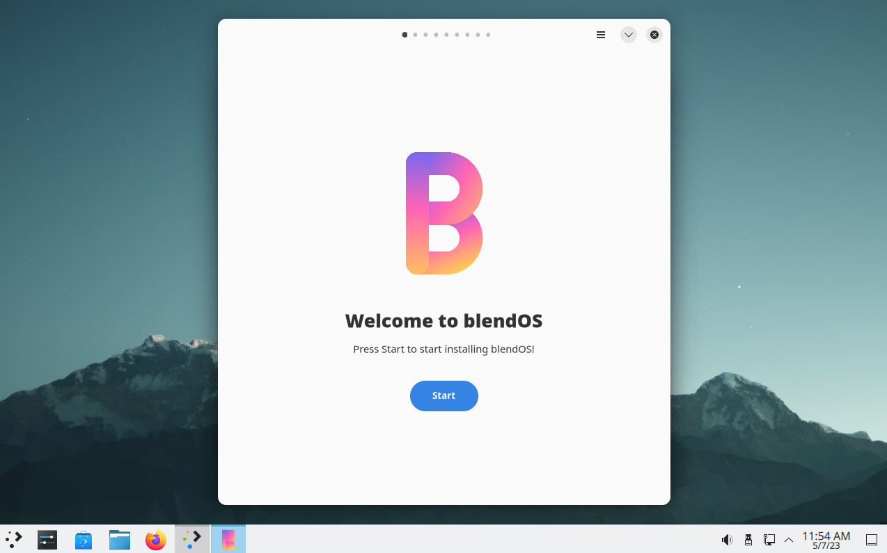

The **blendOS Installer** should pop up. If it doesn't, open it from the **Application Menu** (press the Windows key) and type "installer":

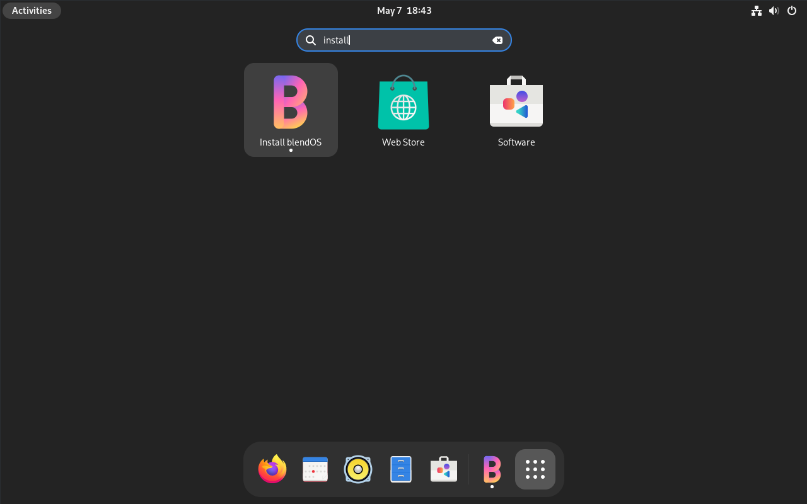

#### Install Steps:

Click **Start** in the installer to begin the install process.

**1.** You'll first be asked to select a keyboard layout:

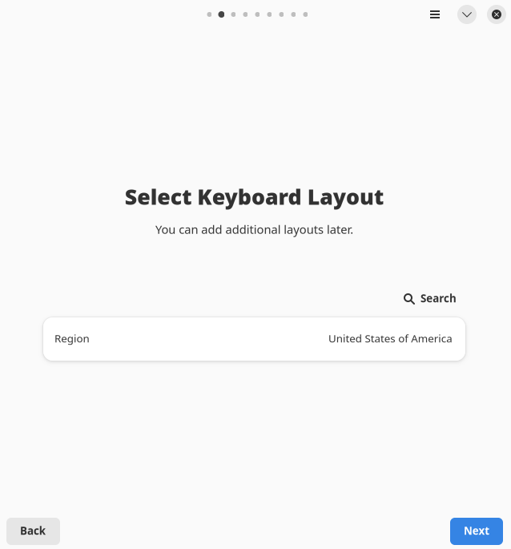

Click **Search** to choose a keyboard layout (even though it says timezone):

**2.** After choosing your keyboard layout, select your **timezone**:

Hit **Search** to see timezone options:

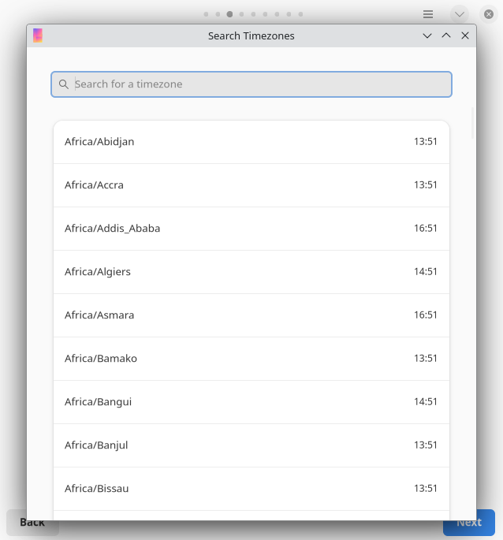

**3.** After you set your region, it's time to set your **locale**:

:::info
**WHAT IS A LOCALE?**

A locale is basically the thing that the system checks to set your currency, time/date layout (dd/mm/yyyy or mm/dd/yyyy) and language.

It also sets your text encoding (UTF-8 is the main one, you need at least one UTF-8 locale)

they're typed like this: `<lang>_<country_code>.<text_encoding>` (ex. `en_US.UTF8`)
:::

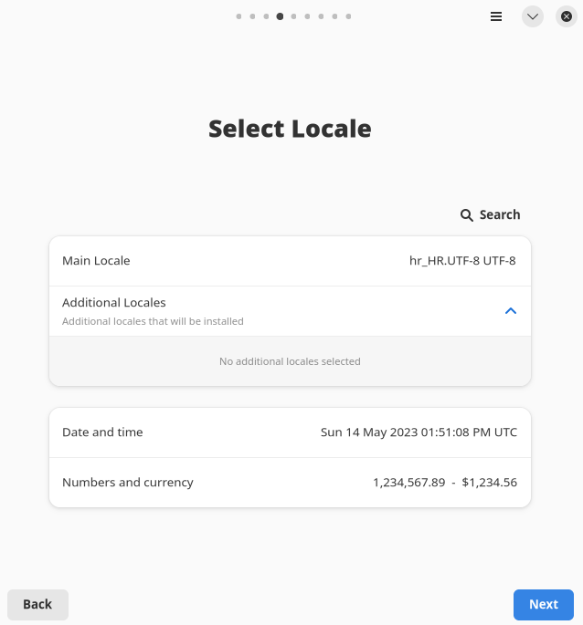

Hit **Search**, then choose a locale, and tick **Use as main locale**:

**4.** Make your **user account**:

**5.** Next, choose the disk you'd like to wipe and partition, or choose **Manual Partitioning**:

:::danger

**WARNING!!**

THIS WILL ERASE ALL DATA ON THE SELECTED DISK!!
:::

**Manual Partitioning** (consult [Appendix A](/guides/installation-guide#appendicies) for how to do this):

Then, check that everything is good in the **Summary**:

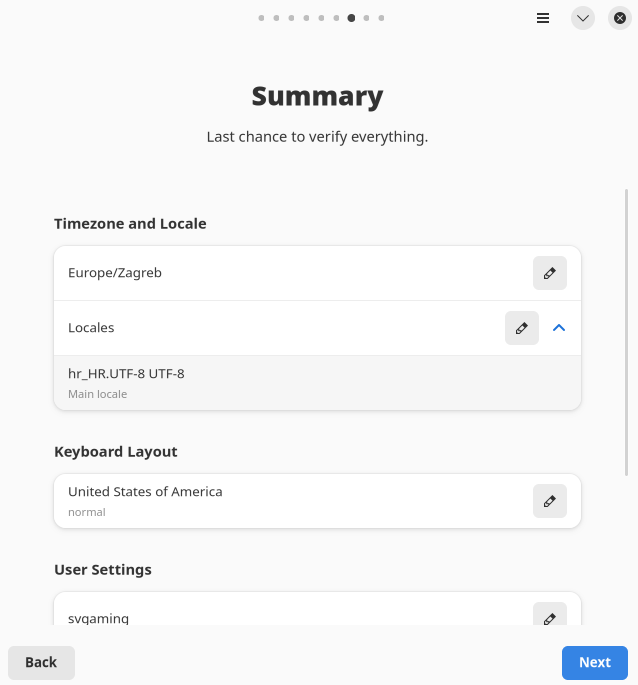

Then, hit **Next** and wait for the installer to finish:

Once the installer finishes, you'll be greeted with an option to reboot:

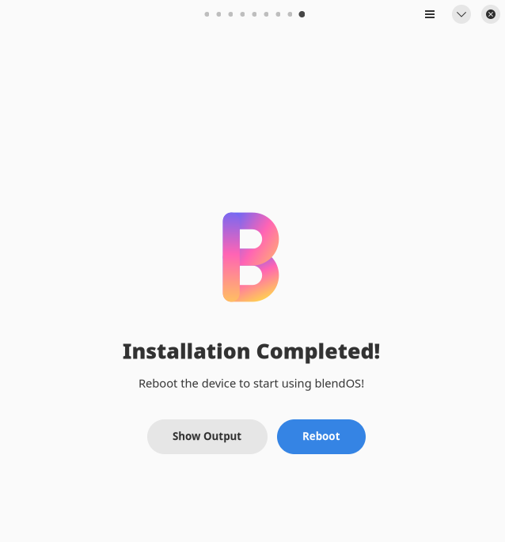

## Appendices

Appendix A: Manual Partitioning

<!-- No headers in dropdowns -->
**How to manually partition ona UEFI system:**

:::danger

If you are using VirtualBox or VMWare (or any BIOS system/hypervisor) this guide is not for you.

:::

1. In the installer, choose **Manual Partitioning**, then **Open GParted**:

Now you should see something like this (but with your partitions):

Choose the disk you'd like to use in the upper right.

2. If you wish to wipe your drive go to `Device > Create Partition Table`:

:::danger

------------------ **WARNING!!** ---------------------

**THIS WILL WIPE ALL DATA AND PARTITIONS ON YOUR DRIVE!**

:::

3. For the partition table choose **GPT** (you *do* have a UEFI system, right?) (most PCs have UEFI)

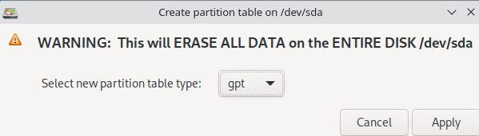

1. Make a new **EFI** partition (`Partition > New` or clicking the `New` icon on the top bar):

In the box, set the `New Size` to 512 and drag the partition to the left side.

Set `File System` to fat32, `Label` it what you want, and hit `Add`.

:::tip

**Changes are not saved in GParted until you hit apply**, so you can tweak all this to your liking.

:::

You should now see this:

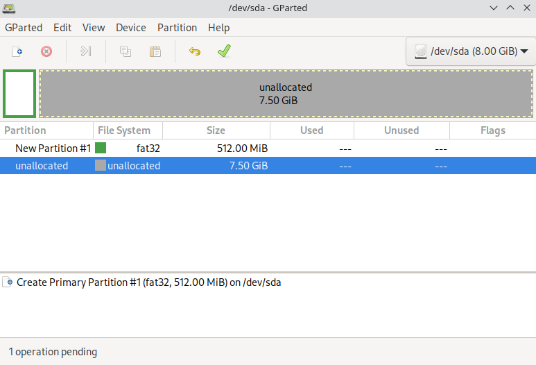

The box on the bottom shows **pending changes**, so you can see what you've done.

**NOTE:** The following step is optional, open the dropdown below to see it.

Making a swap partition

**Why would I want a swap partition?**

Swap is like memory but on your disk, useful if you have a low amount of RAM or do a lot of containerization / virtualization.

<!-- you can't do headers in a dropdown -->

**Making a swap partition**

This is not your only option (you can also [**swap to a file**](https://wiki.archlinux.org/title/Swap#Swap_file) post-install), but here's how to do it:

Make a **new partition** (`Partition > New`) and set it up like the image below:

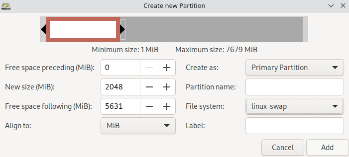

Set type to `linux-swap`, size to whatever you want (1028 MB = 1 GB in this case)

:::tip

If you don't know what size your swap should be, a good rule of thumb is to make it double or half the size of your RAM (depending on which you have the space for)

:::

`Label` it what you want, and hit `Add`.

(you'll see something like this):

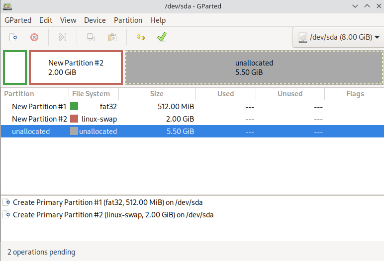

5. Make your main partition:

Make a new partition with the following settings:

* File System: `ext4`
* Space: The rest of your drive (unless you want a seperate `/home`, `/usr`, and/or `/tmp` partition)
* Label: whatever you want

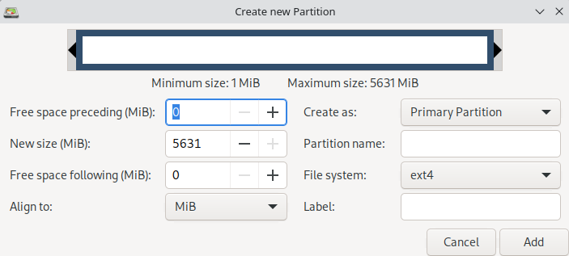

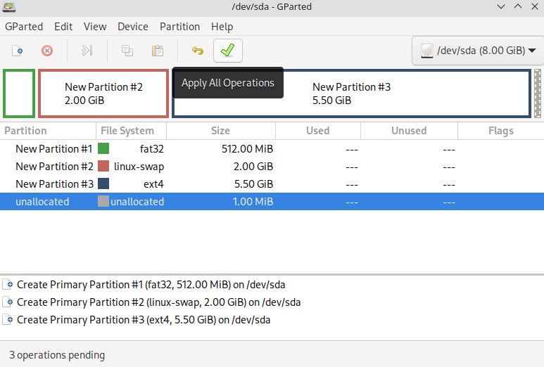

6. Finalizing

Hit `Apply` (the green checkmark)

:::danger

**THIS WILL MAKE WRITE CHANGES TO YOUR DISK!!!**

Make sure that eveything is good before you proceed.

:::

Hit `Apply` again to proceed and wait for the operations to complete.

Once completed, hit `Close`.

Now, go back to the **installer** (hit the refresh icon)

You should see your new partitions below:

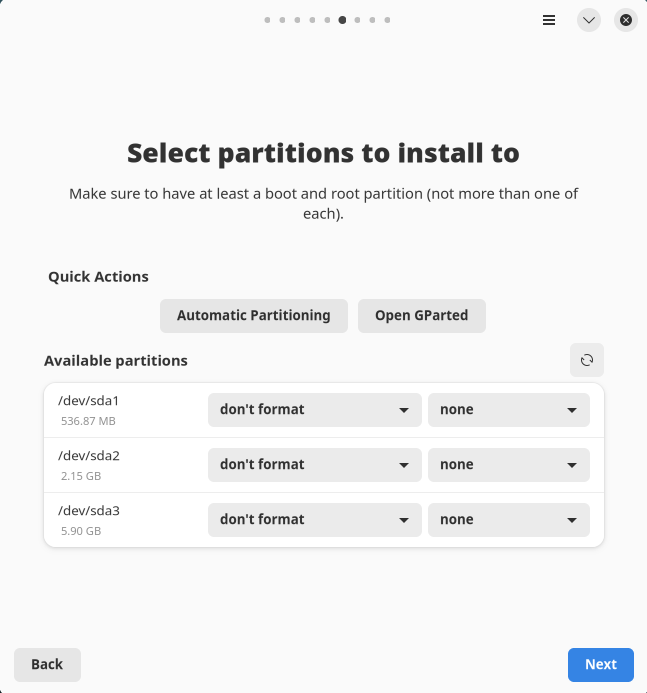

Set the following: (`X` refers to your drive letter, ex. `/dev/sdX` `/dev/sda`) (open the terminal and run `lsblk` to see disks and partitions)

(You may see something different, like `/dev/nvme0n1p1` for partition 1 of NVMe drive 1, but the procedure is the same)

Make sure that you pick the right disk, note down the id of the disk you used (ex. `/dev/sda`) (may also be `/dev/sdb1`, `/dev/sdc1`, etc, but the procedure is the same)

:::info

/dev/sda3 in the table will be /dev/sda2 for you if you didn't make a swap space.

The biggest partition should be mounted at `/` and not formatted (it's your `/dev/sda3`).

:::

| Drive     | Format? | Mount Point |
| --------- | ------- | ----------- |
| /dev/sda1 | No      | `/boot/efi` |
| /dev/sda2 | No      | None        |
| /dev/sda3 | No      | `/`         |

  

  

PluoxHost mirror provided by: [Pluox Hosting](https://pluoxhost.xyz) | 24/7 Freemium Host
