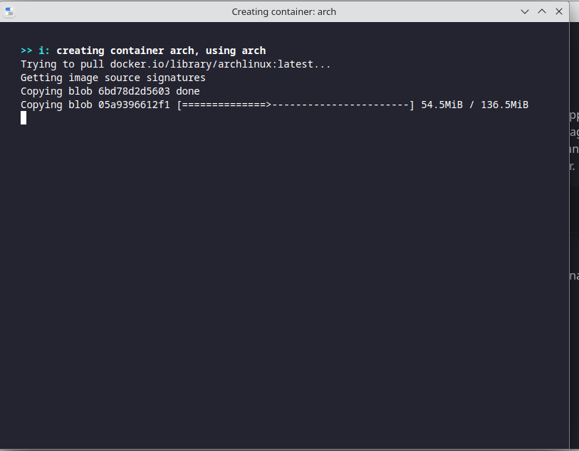
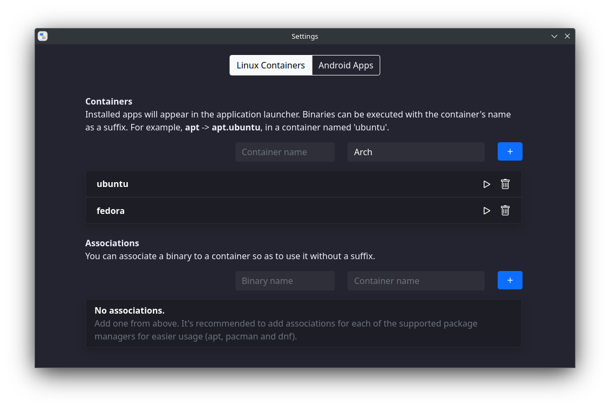
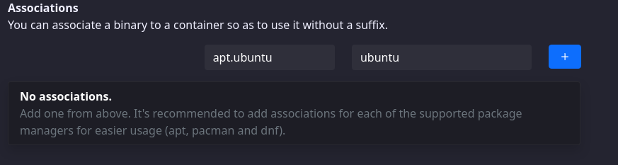
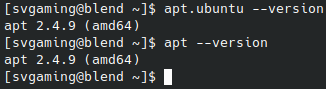
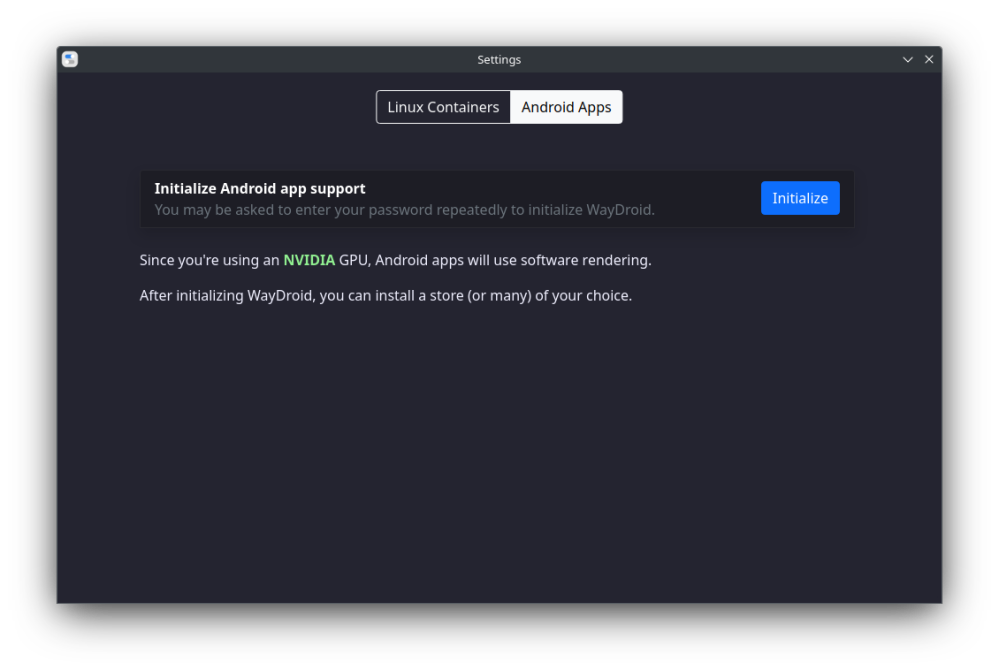
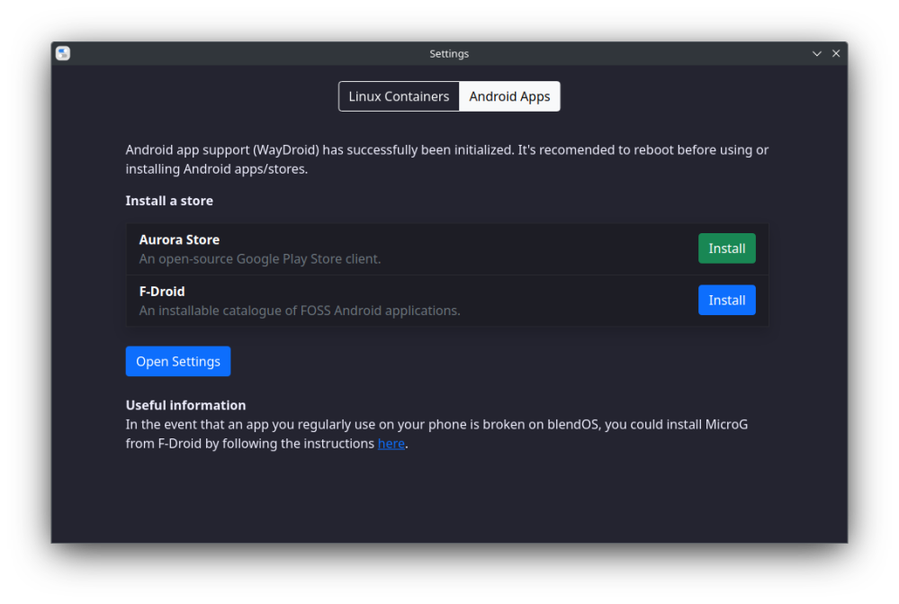

## Intro to the blendOS container manager

Learn how to manage containers with this guide!

The **blendOS container manager**, located in the **blendOS Settings** app, is how you manage containers on blendOS.

:::info

The container manager is **unfinished**, so some features will be missing, this guide will be updated as features are added.

:::

### Using the container manager

To start, you will see something like this:


<div class="gap"></div>

Set the container distro and name in the boxes below and hit `Create Container`.

:::info

Keep in mind that when making your containers, you can name them **whatever you want**, so instead of `arch` and `pacman.arch` you could make it as `ar` and `pacman.ar` to save on keystrokes.

:::

Then, you'll see some creation logs like this:



Once the logs go away, you should see something like this:


<div class="gap"></div>

:::info

If you do not see this, make sure to run `sudo pacman -Syu` and reboot.

:::

On the top are your **containers**, which act as a sort of distro in a distro. From here you can start, reorder (more on that later), or delete them.


<div class="gap"></div>

:::info

Stop/Restart buttons coming soon!

:::

You can also make a **new container** from here, if you want to.

### Binary assosciations

On the bottom, you'll notice you can make **binary assosications**. These allow you to turn container binaries into normal (suffixless) binaries. (ex. `apt.ubuntu` -> `apt`)  


<div class="gap"></div>
  
In blendOS, binaries are run like this:

```
(BINARY_NAME).(CONTAINER_NAME) 

(ex. apt.ubuntu)  
```

But, if we want to run a binary without the stupid suffix, we can use a **Binary assosciation** to make our lives easier. For our example, we want to make `apt.ubuntu` into `apt` and `dnf.fedora` to `dnf`

:::warning

**DO NOT PUT PACMAN IN HERE!**

blendOS already has a system pacman that you can use, just type `pacman --version` to check if it's there. **OVERRIDING THIS IS NOT RECOMMENDED!!!**

:::

To use these, put the binary name in the first box (ex. `apt`) and the container name in the second (ex. `ubuntu`).



You can now load `apt` from the terminal by just typing `apt` instead of `apt.ubuntu`!



:::info

If pacman is not working correctly, just switch to `pacman.<arch_container_name>`, it should work.

Report your pacman issue to [the discord](https://discord.gg/m9JPmZB8Kd) as well.

:::

## Waydroid

In the container manager there is a Waydroid button 👀

This button allows you to run android apps on Linux via containerization!

The moment you press this button, it will initialize waydroid and let you pick one of two app stores.

:::info

Waydroid requires `linux-zen` to work properly, the install instructions for that are [**here**](/guides/installation-guide#step-2-installing-linux-zen-for-waydroid-support)

:::


<div class="gap"></div>

After it initalizes (and you enter your password several times), you should see this. Once you do, **reboot**:



### Aurora setup

Click the **Initialize** button next to Aurora Store in the waydroid menu.

<!-- 63 dashes/equals signs is enough to stretch across the viewer, don't use any more. -->
